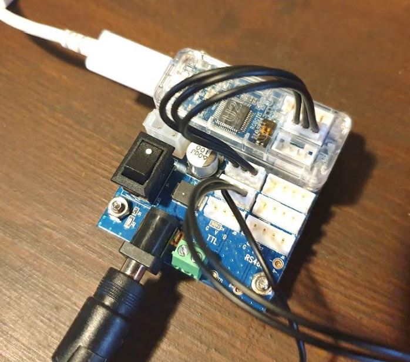
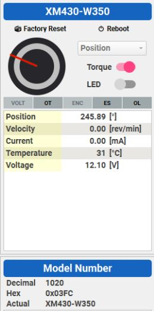

# Lab 1

This lab introduces the Dynamixel Model-X smart servos, compact, high-performance actuators frequently used in contemporary robotics research. In addition, Matlab is used to provide tools for performing the various calculations we will be using later in the course.

---

## Task 1 – Setting up the Dynamixel SDK and software for Matlab on your laptop

1. Download the SDK and store it somewhere sensible: https://emanual.robotis.com/docs/en/software/dynamixel/dynamixel_sdk/overview/  
2. Use the ‘Set Path’ button in Matlab and follow these instructions: https://emanual.robotis.com/docs/en/software/dynamixel/dynamixel_sdk/library_setup/matlab_windows/#matlab-windows 
3. Install MinGW compiler if necessary, using the Matlab Add-Ons button 
4. Matlab should now be configured – try to run the `readwrite.m` example. It should load the library but fail to open the port. 

The *Dynamixel Wizard* is a software used to interface with *Dynamixel*. It allows scanning of the network of actuators to determine ID numbers and communication settings. In additionm manual access to the various functions of each *Dynamixel* is possible. 

1. Download *Dynamixel Wizard*: https://emanual.robotis.com/docs/en/software/dynamixel/dynamixel_wizard2/  

---

## Task 2 – ‘Hello World’ – Moving the Actuator via simple commands 

The *Dynamixels* use three cables for communication and power:
- U2D2 (which converts USB serial to TTL or RS485) 
- U2D2 PHB set (which regulates power from an AC/DC convertor)
- SMPS 12V 5A PS-10 power cable 

**Task**: 
1. Connect *Dynamixel* to the *U2D2* as shown in the above image. 
2. Get the GTAs to check connections before powering up system.
3. Activate the switch on the *U2D2 PHB*
4. Should see the LED light up on the *Dynamixel*  
5. Run the *Dynamixel Wizard*, press the *Options* button and set serial (COM) port to the 
one connected to the *U2D2*. 
6. Scan for connected servos. 
    - Disco lights on the *U2D2 interface* should appear (If no disco lights, incorrect COM port). 
    - Note that this process can take about 3 minutes. 
7. Once the system finds the servo, write down:
    - baud rate
    - ID
    - COM port  
8. Using the interface in the top right of the window:
    - Set actuator in *position* mode
    - Move the servo by hand
    - Encoder value should be changing 

9. Remove hand from servo and toggle *Torque* setting:
   - Click the circle interface to move the servo.  
10. Set servo to *Velocity* control mode. Servo can now spin continuously.
11. Disconnect connection to the servo

---

## Task 3 – Communicating with the Actuator via Matlab 

Setting up *Dynamixel* to talk with *Matlab* using the SDK. This allows automated control of the actuator from MatLab. Note that if the code opens the port and then encounters an error before the port is closed, Matlab will fail to connect to the actuator when run again. Unplug and plug-back-in your USB cable to fix this.  

*After finishing each section, show a GTA the working system and they will tick off this task for your group*

<ins> 

### Read Encoder Position 

</ins>

**Task**:
1. Run the code `Lab1_Read_Dyn_Position.m` 
2. Try turning the servo while observing the output.

**Analysis**:
1. Reading the encoder position is something that cannot be done with regular servos. Why is this? Why is it important to be able to do this? 
2. Look at the `Control Table Address` part of the code (lines 28-30). Note how each command name corresponds to a number. These numbers are variables of the actuator that are stored in local memory (within the actuator). The complete control table can be found on the online documentation for the XM430-W350 actuator.

<ins> 

### Step Demands

</ins>

**Task**:
1. Using the online documentation, look up the control codes for activating the *torque* on the Dynamixel
2. Make it move to a position.   
3. Save the code example with a new file name and modify it to make the *Dynamixel* move to 
`0deg` and then `180deg`. 
   - Use `pause(1)` command after calling each motion command to make sure the actuator has time to get to the target

<ins> 

### Data Logging with Step Demand 

</ins>

**Task**:
1. Write some code that will read the encoder position of the actuator as it is commanded to move between `0deg` and `180deg` (or more steps if you like).
    - Multiple approaches: 
      - Trigger the step demands in an open loop fashion 
      - Use the encoder position to trigger the next target
2. Plot the logged data and save the image. 

**Analysis**:
1. Discuss the actuator response to the step demand within your group. 
    - Why is it also not a step response?
    - Why is the position data not a completely straight line between targets?  

<ins> 

### Trajectory Tracking 

</ins>

**Task**:
1. Write some code to get the Dynamixel to track a sine wave position demand. This requires updating the goal position frequently.